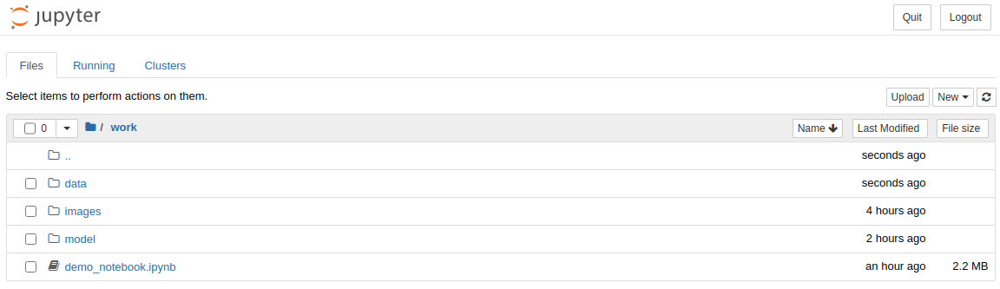

# ARLAS-proc
Spark Library to ingest and process geodata timeseries  

- [ARLAS-proc](#arlas-proc)
  * [Overview](#overview)
  * [Prerequisites](#prerequisites)
    + [Building](#building)
    + [Running](#running)
  * [Build](#build)
    + [JAR](#jar)
    + [Publish SNAPSHOT version to Cloudsmith](#publish-snapshot-version-to-cloudsmith)
  * [Release](#release)
  * [User guide](#user-guide)
    + [Add ARLAS-proc dependency](#add-arlas-proc-dependency)
    + [Test locally through spark-shell](#test-locally-through-spark-shell)
  * [Running tests](#running-tests)
    + [Run test suite](#run-test-suite)
    + [Unit tests relying on external API](#unit-tests-relying-on-external-api)
      - [Capture external API](#capture-external-api)
      - [Use mock server from scala tests](#use-mock-server-from-scala-tests)
  * [Contributing](#contributing)
  * [Authors :](#authors--)
  * [License](#license)
  * [Acknowledgments :](#acknowledgments--)

<small><i><a href='http://ecotrust-canada.github.io/markdown-toc/'>Table of contents generated with markdown-toc</a></i></small>

## Overview

ARLAS-proc is a **toolbox** to transform raw geodata timeseries into enriched movement fragments and trajectories. It is packaged as a scala library for [Apache Spark](https://spark.apache.org/) developers.

## Prerequisites
### Building
- [Java](https://www.java.com/) JDK 8
- [Scala](https://www.scala-lang.org/) 2.12.10
- [SBT](https://www.scala-sbt.org/) 1.5.5

### Running
- [Apache Spark](https://spark.apache.org/) 3.1.2 (for Hadoop 2.7 with OpenJDK 8)
- [Elasticsearch](https://www.elastic.co/fr/elasticsearch/) 7.x

## Build
### JAR
```bash
docker run --rm \
        -w /opt/work \
        -v $PWD:/opt/work \
        -v $HOME/.m2:/root/.m2 \
        -v $HOME/.ivy2:/root/.ivy2 \
        gisaia/sbt:1.5.5_jdk8 \
        sbt clean publishLocal
```

Now, you can add it as a local dependency in your own project

```scala
libraryDependencies += "io.arlas" % "arlas-proc" % "X.Y.Z-SNAPSHOT"
```

### Publish SNAPSHOT version to Cloudsmith

If you have sufficient permissions to our Cloudsmith repository, you can publish a SNAPSHOT build jar to Cloudsmith.

You need to set up the following environment variables first:
- `CLOUDSMITH_USER`
- `CLOUDSMITH_API_KEY` (see [https://cloudsmith.io/user/settings/api/])

```bash
export CLOUDSMITH_USER="your-user"
export CLOUDSMITH_API_KEY="your-api-key"

docker run --rm \
        -w /opt/work \
        -v $PWD:/opt/work \
        -v $HOME/.m2:/root/.m2 \
        -v $HOME/.ivy2:/root/.ivy2 \
        -e CLOUDSMITH_USER=${CLOUDSMITH_USER} \
        -e CLOUDSMITH_API_KEY=${CLOUDSMITH_API_KEY} \
        gisaia/sbt:1.5.5_jdk8 \
        sbt clean publish
```

Now, you can add it as a remote dependency in your own project

```scala
resolvers += "gisaia-public" at "https://dl.cloudsmith.io/public/gisaia/public/maven/"
libraryDependencies += "io.arlas" % "arlas-proc" % "X.Y.Z-SNAPSHOT"
```

## Release

If you have sufficient permissions on Github repository, simply type:

```bash
docker run -ti \
        -w /opt/work \
        -v $PWD:/opt/work \
        -v $HOME/.m2:/root/.m2 \
        -v $HOME/.ivy2:/root/.ivy2 \
        -e CLOUDSMITH_USER=${CLOUDSMITH_USER} \
        -e CLOUDSMITH_API_KEY=${CLOUDSMITH_API_KEY} \
        gisaia/sbt:1.5.5_jdk8 \
        sbt clean release
```

You will be asked for the versions to use for release & next version.

A jar artifact tagged in the released version will be automatically published to Cloudsmith.

## User guide

### Add ARLAS-proc dependency
To enable the retrieval of ARLAS-proc via sbt, add our Cloudsmith repository in your build.sbt file.

```scala
resolvers += "gisaia-public" at "https://dl.cloudsmith.io/public/gisaia/public/maven/"
```
Specify ARLAS-proc dependency in the dependencies section of your build.sbt file by adding the following line.
```scala
libraryDependencies += "io.arlas" % "arlas-proc" % "X.Y.Z"
```

### Test locally through Jupyter Notebook

- Build fat jar of ARLAS-PROC project and publish it in local .ivy2
```bash
docker run --rm \
        -w /opt/work \
        -v ${PWD}:/opt/work \
        -v $HOME/.m2:/root/.m2 \
        -v $HOME/.ivy2:/root/.ivy2 \
        gisaia/sbt:1.5.5_jdk8 \
        /bin/bash -c 'sbt clean assembly; sbt clean publishLocal; cp -r /root/.ivy2/local/io.arlas/arlas-proc_2.12/. /root/.ivy2/local/io.arlas/arlas-proc/'
```

- Launch jupyter tutorial notebook
```bash
docker run -it --rm \
       -v ${PWD}/data/ais:/home/jovyan/work/ \
       -v $HOME/.m2:/home/jovyan/.m2 \
       -v $HOME/.ivy2:/home/jovyan/.ivy2 \
       -p "8888:8888" \
       almondsh/almond:0.9.1-scala-2.12.10
```

Open the link proposed in terminal to open Jupyter Notebook in a browser: `http://127.0.0.1:8888/?token=...`



Open `demo_notebook.ipynb` to run the tutorial notebook.

### Test locally through spark-shell

Start an interactive spark-shell session. For example :
- Build fat jar of ARLAS-PROC project
```bash
docker run --rm \
        -w /opt/work \
        -v ${PWD}:/opt/work \
        -v $HOME/.m2:/root/.m2 \
        -v $HOME/.ivy2:/root/.ivy2 \
        gisaia/sbt:1.5.5_jdk8 \
        /bin/bash -c 'sbt clean assembly; cp target/scala-2.12/arlas-proc-assembly*.jar target/scala-2.12/arlas-proc-assembly.jar'
```

- Launch spark-shell with ARLAS-PROC dependency
```bash
docker run -ti \
       -w /opt/work \
       -v ${PWD}/data/ais:/opt/ais \
       -v ${PWD}:/opt/proc \
       -v $HOME/.m2:/root/.m2 \
       -v $HOME/.ivy2:/root/.ivy2 \
       -p "4040:4040" \
       gisaia/spark:3.1.2 \
       spark-shell \
        --packages org.elasticsearch:elasticsearch-spark-30_2.12:7.13.4,org.geotools:gt-referencing:20.1,org.geotools:gt-geometry:20.1,org.geotools:gt-epsg-hsql:20.1 \
        --exclude-packages javax.media:jai_core \
        --repositories https://repo.osgeo.org/repository/release/,https://dl.cloudsmith.io/public/gisaia/public/maven/,https://repository.jboss.org/maven2/ \
        --jars /opt/proc/target/scala-2.12/arlas-proc-assembly.jar
```

#### Tutorial with boat location data

This tutorial applies a processing pipeline to vessel location records to extract the real boats trajectories.

We use a sample of AIS (Automatic Identification System) data provided by the Danish Maritime Authority, in accordance with the conditions for the use of Danish public data.

We process the records emitted by two vessels on the 20th of November 2019.

Paste (using `:paste`) the following code snippets in the spark-shell

- Import ARLAS-PROC library modules
```scala
import io.arlas.data.sql._
import io.arlas.data.model._
import io.arlas.data.transform._
import io.arlas.data.transform.fragments._
import io.arlas.data.transform.features._
import io.arlas.data.transform.timeseries._
import io.arlas.data.transform.ml._
import io.arlas.data.transform.tools._
```

- Set the object identifier, latitude, longitude and date column to handle moving object data properly
```scala
val dataModel = DataModel(
  idColumn = "MMSI",
  latColumn = "Latitude",
  lonColumn = "Longitude",
  timestampColumn = "# Timestamp",
  timeFormat = "dd/MM/yyyy HH:mm:ss"
)
```

- Extract raw data from csv
```scala
val raw_data = readFromCsv(spark, delimiter=",", sources="/opt/ais/data/extract_2_ids.csv")
        .select("# Timestamp", "MMSI", "Latitude", "Longitude", "SOG", "COG", "Heading", "IMO", "Callsign", "Name",
                "Ship type", "Cargo type", "Width", "Length")
raw_data.show()
```

- Format data by setting numeric variable types and processing unix timestamp
```scala
val formatted_data = raw_data.asArlasFormattedData(dataModel, doubleColumns = Vector("SOG", "COG", "Heading"))
formatted_data.sort("MMSI", "arlas_timestamp").show()
```
We can see two new columns: arlas_timestamp which is the unix timestamp corresponding to '# Timestamp'
and arlas_partition, corresponding to the day

- Fill the missing vessel properties 
```scala
// Fill the missing vessel properties when they are available in at least one observation for a given vessel identified with its MMSI
val static_filled_data = formatted_data.process(
  new StaticColumnsStandardizer(
    "MMSI",
    Map(
      "IMO" -> ("Unknown", "Undefined"),
      "Callsign" -> ("Undefined", "Undefined"),
      "Name" -> ("Undefined", "Undefined"),
      "Ship type" -> ("Undefined", "Undefined"),
      "Cargo type" -> (null, "Undefined"),
      "Width" -> (null, "Undefined"),
      "Length" -> (null, "Undefined")
    )
  )
)
static_filled_data.sort("MMSI", "arlas_timestamp").show()
```
- Create basic fragments and compute associated fields:
  - **arlas_track_id**: Unique fragment identifier
  - **arlas_track_nb_geopoints**: Number of ais messages (geopoints) summarized in the fragment (2 at this step)
  - **arlas_track_trail**: Geometry of vessel travel over the fragment (a simple line at this step)
  - **arlas_track_duration_s**: Duration of the fragment (s)
  - **arlas_track_timestamp_start**: Timestamp of the first observation of the fragment
  - **arlas_track_timestamp_end**: Timestamp of the last observation of the fragment
  - **arlas_track_timestamp_center**: Middle timestamp of the fragment
  - **arlas_track_end_location_lat**: Latitude of the last observation of the fragment
  - **arlas_track_end_location_lon**: Longitude of the last observation of the fragment
  - **arlas_track_location_lat**: Latitude of the centroid of the fragment
  - **arlas_track_location_lon**: Longitude of the centroid of the fragment
  - **arlas_track_distance_gps_travelled_m**: Distance (m) travelled by the vessel over the fragment
  - **arlas_track_distance_gps_straight_line_m**: Direct distance (m) between first and last observation of the fragment
  - **arlas_track_distance_gps_straightness**: Ratio between direct distance and travelled distance over the fragment (1 at this step)
  - **arlas_track_dynamics_gps_speed**: Computed gps speed over the fragment
  - **arlas_track_dynamics_gps_bearing**: Computed gps bearing over the fragment

It also transforms numeric column by taking the average of the fragment observations (ex: "SOG" -> "arlas_track_sog")

```scala
val fragment_data = static_filled_data.process(
  new FlowFragmentMapper(dataModel,
    spark,
    aggregationColumnName = dataModel.idColumn,
    averageNumericColumns = List("SOG", "COG", "Heading"))
)
fragment_data.sort("MMSI", "arlas_timestamp").show()
```

- Add the motion visibility for each fragment
```scala
val visibility_data = fragment_data.process(
  // Identify fragment as invisible when duration since previous observation is higher than 30min
  new WithVisibilityProportion(durationThreshold = 1800),
  // Detect visibility change ("appear": invisible->visible, "disappear": visible->invisible)
  new WithVisibilityChange(dataModel = dataModel)
)
visibility_data
        .select("MMSI", "arlas_timestamp", "arlas_track_duration_s", "arlas_track_visibility_proportion", "arlas_track_visibility_change")
        .sort("MMSI", "arlas_timestamp")
        .show()
```

- Identify the moving state of the vessel for each fragment
```scala
val moving_data = visibility_data.process(
  // Detect if the boat is still or moving with an hmm model based on speed
  new WithMovingState(spark,
    idColumn = "MMSI",
    speedColumn = "arlas_track_SOG",
    targetMovingState = "arlas_moving_state",
    stillMoveModelPath = "/opt/ais/model/hmm_still_move.json"),
  // Create a common identifier for consecutive fragment sharing the same moving state
  new WithStateIdOnStateChangeOrUnique(idColumn = "MMSI",
    stateColumn = "arlas_moving_state",
    orderColumn = "arlas_track_timestamp_start",
    targetIdColumn = "arlas_motion_id"),
  // Update the motion identifier as MMSI#timestampStart_timestampEnd
  new IdUpdater(idColumn = "arlas_motion_id", dataModel = dataModel),
  // Compute the duration of each motion
  new WithDurationFromId(idColumn = "arlas_motion_id", targetDurationColumn = "arlas_motion_duration")
)
moving_data
        .select("MMSI", "arlas_timestamp", "arlas_track_SOG", "arlas_moving_state", "arlas_motion_id", "arlas_motion_duration")
        .sort("MMSI", "arlas_timestamp")
        .show()
```

- Build course information from moving state
```scala
val course_data = moving_data.process(
  // Identify fragment as a STOP if the vessel is still for more than 10 minutes, as COURSE else
  // The result is stored in a column "arlas_course_or_stop"
  new WithCourseOrStop(courseTimeoutS = 600),
  // Identify fragments as PAUSE when the vessel is still for less than 10 minutes, and MOTION when vessel is moving
  // The result is stored in a column "arlas_course_state"
  new WithCourseState(),
  // Create the course identifier (stored in "arlas_course_id")
  new WithStateIdOnStateChangeOrUnique(idColumn = "MMSI",
    stateColumn = "arlas_course_or_stop",
    orderColumn = "arlas_track_timestamp_start",
    targetIdColumn = "arlas_course_id"),
  // Update the course identifier as MMSI#timestampStart_timestampEnd
  new IdUpdater(dataModel = dataModel, idColumn = "arlas_course_id"),
  // Compute the course duration (stored in "arlas_course_duration")
  new WithDurationFromId(idColumn = "arlas_course_id", targetDurationColumn = "arlas_course_duration")
)
course_data
        .select(
          "MMSI", "arlas_timestamp", "arlas_moving_state", "arlas_motion_id", "arlas_motion_duration",
          "arlas_course_or_stop", "arlas_course_state", "arlas_course_id", "arlas_course_duration"
        )
        .sort("MMSI", "arlas_timestamp")
        .show(false)
```

- Concatenate the Pauses and Stops into single fragments
```scala
val zipped_stop = course_data.process(
  new StopPauseSummaryTransformer(
    spark,
    dataModel,
    weightAveragedColumns = Some(
      Seq(
        "arlas_track_dynamics_gps_speed",
        "arlas_track_dynamics_gps_bearing",
        "arlas_track_SOG",
        "arlas_track_COG",
        "arlas_track_Heading",
        "arlas_track_visibility_proportion"
      )),
    propagatedColumns = Some(Seq("IMO", "Callsign", "Name", "Ship type", "Cargo type", "Width", "Length"))
  )
)
zipped_stop.select("MMSI", "arlas_timestamp", "arlas_track_duration_s", "arlas_moving_state", "arlas_motion_id",
                   "arlas_motion_duration", "arlas_course_or_stop", "arlas_course_state", "arlas_course_id", 
                   "arlas_course_duration", "arlas_track_trail")
           .sort("MMSI", "arlas_timestamp")
           .show()
```

- Concatenate all fragments associated to a course into a single course fragment
```scala
val course_extracted = zipped_stop.process(
  new CourseExtractorTransformer(
    spark,
    dataModel,
    weightAveragedColumns = Some(
      Seq(
        "arlas_track_dynamics_gps_speed",
        "arlas_track_dynamics_gps_bearing",
        "arlas_track_SOG",
        "arlas_track_COG",
        "arlas_track_Heading",
        "arlas_track_visibility_proportion"
      )),
    propagatedColumns = Some(Seq("IMO", "Callsign", "Name", "Ship type", "Cargo type", "Width", "Length"))
  )
)
course_extracted
  .select(
    "MMSI", "arlas_timestamp", "arlas_track_duration_s", "arlas_track_nb_geopoints", "arlas_departure_stop_before_duration_s",
    "arlas_arrival_stop_after_duration_s", "arlas_moving_state", "arlas_course_or_stop", "arlas_course_state",
    "arlas_course_id", "arlas_course_duration", "arlas_track_trail"
  )
  .sort("MMSI", "arlas_timestamp")
  .show()
```

- Write course result in a csv file
```scala
course_extracted.writeToCsv("/opt/ais/data/ais_course_data")
```

## Running tests

### Run test suite

```bash
docker run -ti \
        -w /opt/work \
        -v $PWD :/opt/work \
        -v $HOME/.m2:/root/.m2 \
        -v $HOME/.ivy2:/root/.ivy2 \
        -e CLOUDSMITH_USER=${CLOUDSMITH_USER} \
        -e CLOUDSMITH_API_KEY=${CLOUDSMITH_API_KEY} \
        gisaia/sbt:1.5.5_jdk8 \
        sbt clean test
```

### Unit tests relying on external API

External APIs are mocked using Wiremock. Wiremock has 2 benefits:

- using a JAR, we can capture every call to an API and save the results for further use
- then from scala tests, we can start a wiremock server and get these results.

#### Capture external API 

Download the standalone JAR from `http://repo1.maven.org/maven2/com/github/tomakehurst/wiremock-standalone/2.25.1/wiremock-standalone-2.25.1.jar` and save it into the `src/test/resources/wiremock` folder.

Launch the JAR by replacing `https://external.api.com` with your own API: 

```bash
java -jar wiremock-standalone-2.25.1.jar --verbose --proxy-all="https://external.api.com" --record-mappings
```

Then in order to save the API results, change the API url to `http://localhost:8080` within the requests.

For example, to save nominatim results, you can do:
```bash
java -jar wiremock-standalone-2.25.1.jar --verbose --proxy-all="http://nominatim.services.arlas.io" --record-mappings
curl "http://localhost:8080/reverse.php?format=json&lat=41.270568&lon=6.6701225&zoom=10"
```

The results will be saved into the resources folder, which is used by scala tests.

#### Use mock server from scala tests

A test class can extend the trait `ArlasMockServer`, which automatically starts and stops the mock server.

## Contributing
Please read [CONTRIBUTING.md](CONTRIBUTING.md) for details on our code of conduct, and the process for submitting us pull requests.

## Authors
- Gisaïa - *Initial work* - [Gisaïa](http://gisaia.com/)

See also the list of [contributors](https://github.com/gisaia/ARLAS-proc/graphs/contributors) who participated in this project.

## License
This project is licensed under the Apache License, Version 2.0. See [LICENSE.txt](LICENSE.txt) for details.

## Acknowledgments
This project has been initiated and is maintained by [Gisaïa](http://gisaia.com/)